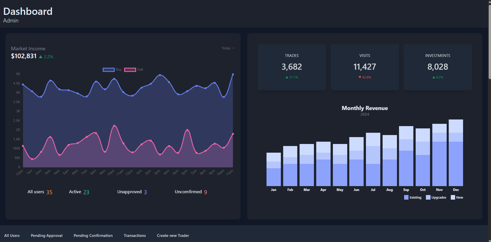

<h1 align="center" id="title">TradeMaster</h1>

<p>Trade Faster, Trade Smarter.</p>


<br>
<p id="description">A comprehensive stock trading platform designed to cater to both admins and traders.
<br>
<br>


For traders, TradeMaster offers a seamless trading experience. Traders can create an account, log in with their credentials, and receive email confirmations for their account sign-ups. Once their account is approved, traders can start buying stocks to add to their investments. The app features a ‘Portfolio’ page where traders can view all their stocks, and a ‘Transaction’ page to monitor all transactions made by buying and selling stocks. Traders also have the option to sell their stocks to earn money.</p>
<br>
<br>



For admins, the app provides a robust management system that allows them to manually add new traders, update trader details, and view specific trader information. Admins can track all registered traders and monitor the transaction flow within the app. A dedicated page for pending trader sign-ups makes it easy to check for new trader registrations. Admins also have the authority to approve trader sign-ups, enabling the new traders to start adding stocks.
<br>

<h2>📈Installation :</h2>

<p>1. Clone our repo</p>

```
git clone https://github.com/jeanevabejar/trader_stock_app
```

<p>2. Navigate to trader_stock_app && Install dependencies</p>

```
bundle install
```

<p>3. Start App!</p>

```
bin/dev
```

<h2>📊 Built with</h2>

>gem "devise", "~> 4.9"

>gem 'iex-ruby-client'

>gem "tailwindcss-rails"

<br>
<h3>For Testing</h4>

>gem "capybara"

>gem "selenium-webdriver"

>gem 'rspec-rails', '~> 6.1', '>= 6.1.1'

>gem 'database_cleaner-active_record'

>gem 'factory_bot_rails'

>gem "nyan-cat-formatter"

>gem 'shoulda', '5.0.0.rc1'


<h2>💸 Additional Information for curious cats</h2>
<h6>Note: after bundle install


<h4>gem 'rspec-rails', '~> 6.1', '>= 6.1.1'

```
rails generate rspec:install
```

<h4>gem "nyan-cat-formatter"

```
gem install nyan-cat-formatter
```

<h4>gem 'shoulda-matchers', '~> 6.0'
<br>

>shoulda matchers in rails_helper.rb

<h4>gem 'factory_bot_rails'
<br>

>config.include FactoryBot::Syntax::Methods in rails_helper.rb


<h4>rspec vscode extension:

- vscode-run-rspec-file
- click Gear Icon
- click Extension Keyboard Shortcuts
